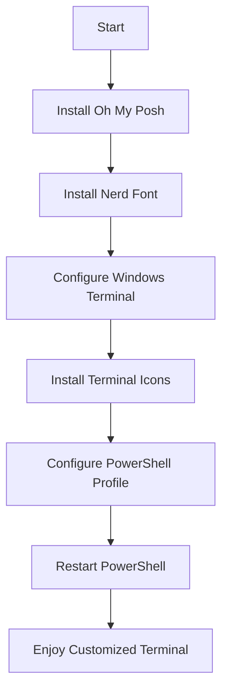

# A Comprehensive Guide to Customizing Windows Terminal with Oh My Posh

## Prerequisites

- Windows 10 or 11
- Windows Terminal (install from Microsoft Store if not already installed)
- PowerShell 5.1 or PowerShell Core 6+ (preferably PowerShell 7+)
- Administrator privileges

## Installation and Setup Process



## Detailed Steps

### Step 1: Install Oh My Posh

#### Option A: Using winget (recommended)

1. Open PowerShell as Administrator
2. Run the following command:
   ```powershell
   winget install JanDeDobbeleer.OhMyPosh -s winget
   ```

#### Option B: Using Chocolatey

1. If Chocolatey is not installed, install it first:
   ```powershell
   Set-ExecutionPolicy Bypass -Scope Process -Force; [System.Net.ServicePointManager]::SecurityProtocol = [System.Net.ServicePointManager]::SecurityProtocol -bor 3072; iex ((New-Object System.Net.WebClient).DownloadString('https://community.chocolatey.org/install.ps1'))
   ```
2. Install Oh My Posh:
   ```powershell
   choco install oh-my-posh
   ```

### Step 2: Install a Nerd Font

1. Visit https://www.nerdfonts.com/font-downloads
2. Choose a font (e.g., "CascadiaCode" or "SourceCodePro")
3. Click the download button
4. Once downloaded, locate the zip file in your Downloads folder
5. Right-click the zip file and select "Extract All..."
6. Choose a destination folder and click "Extract"
7. Open the extracted folder
8. Select all font files (usually .ttf or .otf files)
9. Right-click and choose "Install" or "Install for all users"
10. Wait for the installation to complete

### Step 3: Configure Windows Terminal

1. Open Windows Terminal
2. Click the down arrow in the tab bar and select "Settings"
3. In the left sidebar, click on "Open JSON file"
4. In the `profiles` section, add or modify the `defaults` object:
   ```json
   "profiles": {
     "defaults": {
       "font": {
         "face": "CascadiaCode NF",
         "size": 11
       }
     },
     "list": [
       // ... existing profiles ...
     ]
   }
   ```
   Replace "CascadiaCode NF" with the name of the Nerd Font you installed
5. Save the file and close it

### Step 4: Install Terminal Icons (optional)

1. Open PowerShell
2. Run the following command:
   ```powershell
   Install-Module -Name Terminal-Icons -Repository PSGallery -Force
   ```

### Step 5: Configure PowerShell Profile

1. Open PowerShell
2. Run the following command to create or open your profile:
   ```powershell
   if (!(Test-Path -Path $PROFILE)) { New-Item -ItemType File -Path $PROFILE -Force }
   notepad $PROFILE
   ```
3. Add the following lines to your profile:
   ```powershell
   oh-my-posh init pwsh --config 'C:\Users\ditah\AppData\Local\Programs\oh-my-posh\themes\clean-detailed.omp.json' | Invoke-Expression
   Import-Module -Name Terminal-Icons
   ```
4. Save the file and close it

### Step 6: Restart PowerShell

Close and reopen PowerShell, or run the following command to reload your profile:
```powershell
. $PROFILE
```

## Additional Tips

1. **Exploring themes:**
   - Browse themes at https://ohmyposh.dev/docs/themes
   - To try a different theme, replace the config path in your profile with:
     ```powershell
     oh-my-posh init pwsh --config "$env:POSH_THEMES_PATH\<theme-name>.omp.json" | Invoke-Expression
     ```
     Replace `<theme-name>` with the desired theme name

2. **Customizing themes:**
   - Copy a theme JSON file from `$env:POSH_THEMES_PATH` to a personal location
   - Edit the JSON file to customize colors, segments, etc.
   - Update your profile to use the custom theme file

3. **Troubleshooting:**
   - If icons don't appear correctly, ensure you've installed a Nerd Font and configured Windows Terminal to use it
   - If colors seem off, check your terminal color scheme in the Windows Terminal settings

4. **Additional customization:**
   - Explore Oh My Posh documentation for advanced configuration options: https://ohmyposh.dev/docs/
   - Consider adding aliases or custom functions to your PowerShell profile for frequently used commands

By following these steps, you should have a fully customized Windows Terminal with Oh My Posh, complete with a stylish prompt and custom font. Remember to experiment with different themes and settings to find what works best for you!

